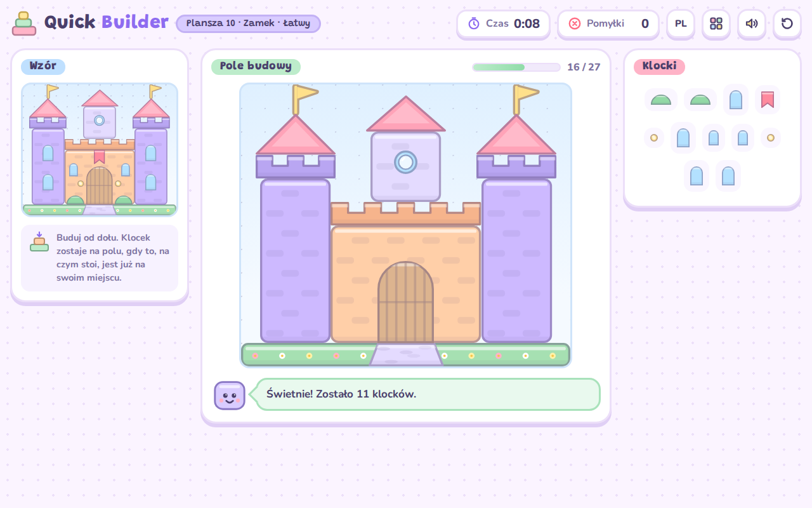
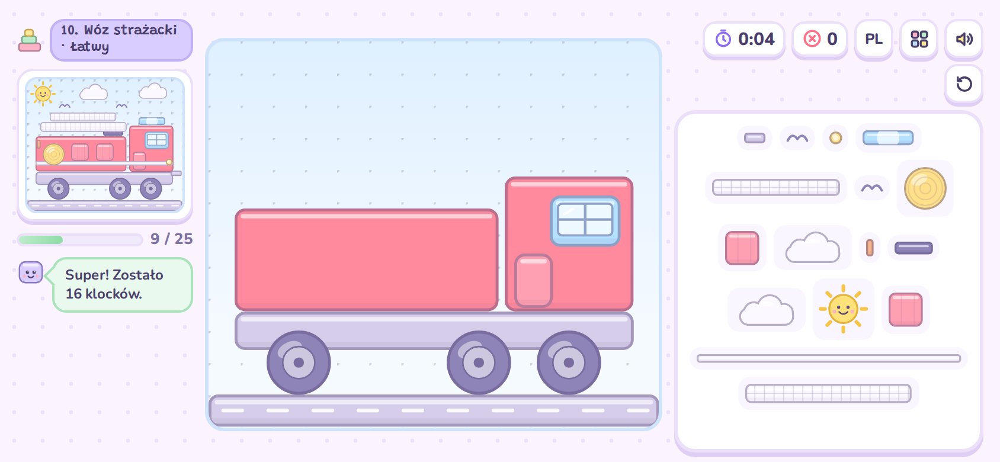
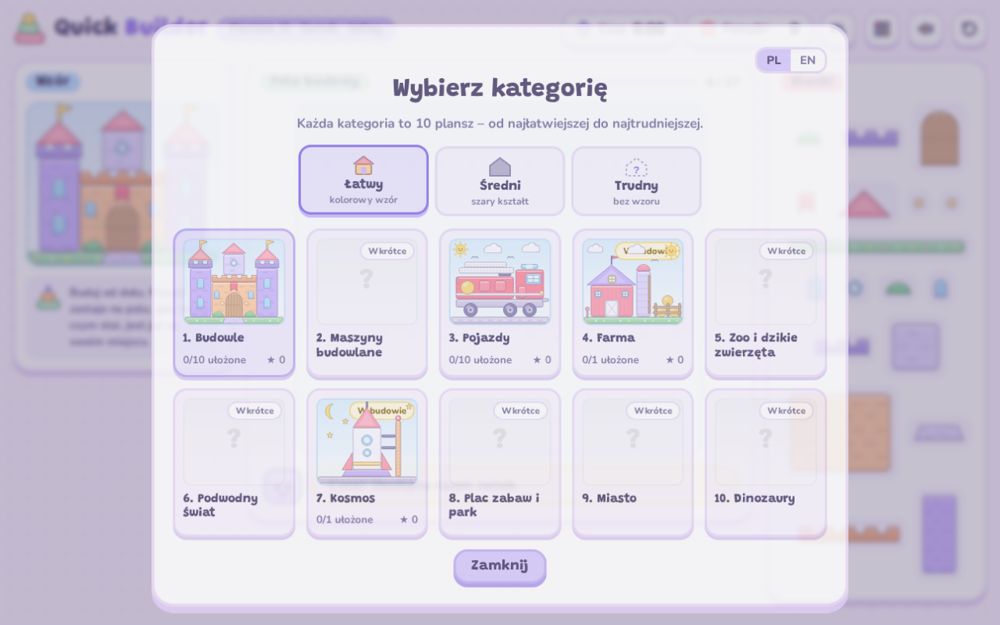

# Quick Builder

**Kolorowa gra w układanie klocków dla dzieci (7–9 lat).** Dziecko patrzy na wzór i przeciąga klocki na pole budowy. Buduje od dołu do góry, na czas i bez pomyłek.

▶️ **Zagraj:** https://mjwawa.github.io/quick_builder/

## Jak grać

1. Wybierz kategorię i planszę.
2. Popatrz na wzór – tak ma wyglądać budowla.
3. Przeciągnij klocek na pole albo dotknij klocka, a potem jego miejsca.
4. Buduj od dołu do góry – klocek musi na czymś stać. Zła kolejność? Klocek wraca na swoje miejsce.
5. Szybko i bez pomyłek = 3 gwiazdki. Po 3 pomyłkach z rzędu pojawia się podpowiedź.

## Co jest w grze

- **10 kategorii po 10 plansz (100 plansz)**, od najłatwiejszej (8 klocków) do najtrudniejszej (27 klocków). Plansze w kategorii odblokowują się po kolei.
- **Kategoria bonusowa „Bajkowy świat”** – 10 dodatkowych plansz (od 10 do 28 klocków), które odblokowuje się zbieraniem gwiazdek. Liczą się gwiazdki z każdego poziomu trudności osobno, więc opłaca się zagrać też na Średnim i Trudnym.
- **3 poziomy trudności:**
  - Łatwy – kolorowy wzór;
  - Średni – szara sylwetka, bez podziału na klocki;
  - Trudny – wzór widać tylko przed startem, trzeba go zapamiętać.
- **Języki:** polski, angielski i francuski – do wyboru z listy w grze. Przy pierwszym uruchomieniu gra włącza język przeglądarki (nieobsługiwany = angielski).
- **Komputer, tablet i telefon:** myszka albo palec. Na telefonie gra działa w poziomie.
- **Aplikacja (PWA):** instaluje się jednym przyciskiem na iPhonie, iPadzie, Androidzie i komputerze. Działa na pełnym ekranie i bez internetu, sama się aktualizuje, nie zbiera ani nie wysyła żadnych danych.
- Dźwięki, konfetti, rekordy, gwiazdki dla każdej planszy i licznik wszystkich zdobytych gwiazdek.

## Kategorie (10 × 10 = 100 plansz)

| # | Kategoria | Plansze (od najłatwiejszej) |
|---|---|---|
| 1 | Budowle | Budka dla ptaków, Namiot, Domek, Igloo … Most, Zamek |
| 2 | Maszyny budowlane | Taczka, Betoniarka, Walec … Dźwig, Gruszka do betonu, Plac budowy |
| 3 | Pojazdy | Hulajnoga, Rower, Motocykl … Pociąg, Samolot, Wóz strażacki |
| 4 | Farma | Kaczka, Kura, Świnka … Kurnik, Stodoła, Pasieka |
| 5 | ZOO | Ślimak, Żółw, Sowa … Słoń, Żyrafa, Brama ZOO |
| 6 | Podwodny świat | Rybka, Meduza, Krab … Łódź podwodna, Rafa koralowa, Skrzynia skarbów |
| 7 | Kosmos | Planeta z pierścieniem, Księżyc z flagą … Baza na Księżycu, Układ Słoneczny |
| 8 | Instrumenty | Bębenek, Marakasy, Cymbałki … Pianino, Perkusja, Scena koncertowa |
| 9 | Miasto | Sygnalizator, Budka z lodami, Sklepik … Ratusz z zegarem, Wieżowiec, Ulica miasta |
| 10 | Słodkości | Lizak, Lody w rożku, Babeczka … Tort urodzinowy, Domek z piernika, Cukiernia |

### Kategoria bonusowa: Bajkowy świat

Plansze odblokowują się, gdy łączna liczba gwiazdek (ze wszystkich poziomów trudności) osiągnie próg. Po przekroczeniu progu gra pokazuje komunikat „Nowa plansza bonusowa!”.

| Plansza | Grzybkowy domek | Czarodziejski kociołek | Latający dywan | Karoca z dyni | Jednorożec | Chatka na kurzej nóżce | Wieża Roszpunki | Statek piracki | Smok | Zamek w chmurach |
|---|---|---|---|---|---|---|---|---|---|---|
| Próg | 10 ★ | 25 ★ | 50 ★ | 80 ★ | 120 ★ | 160 ★ | 210 ★ | 270 ★ | 340 ★ | 420 ★ |

  
  

## Instalacja

Otwórz https://mjwawa.github.io/quick_builder/ i stuknij **Zainstaluj grę na ekranie** na ekranie powitalnym.

- **Android, komputer (Chrome/Edge):** otworzy się systemowe okno instalacji.
- **iPhone/iPad (Safari):** **Udostępnij** (albo najpierw **⋯**) → **Do ekranu początkowego** → **Dodaj**.
- **Mac (Safari):** **Plik → Dodaj do Docka**.

Uruchom grę raz z internetem – potem działa także offline.

## Pliki w repozytorium

| Plik | Po co |
|---|---|
| `index.html` | cała gra (HTML, CSS i JavaScript w jednym pliku) |
| `manifest.webmanifest` | nazwa, ikona i ustawienia apki |
| `sw.js` | tryb offline (pamięć podręczna plików gry) |
| `icons/` | ikony apki (180, 192, 512 px + wersja 1024 px) |
| `fonts/` | czcionki Grandstander i Nunito wbudowane w grę |
| `splash/` | ekrany startowe iPhone/iPad |
| `screenshots/` | zrzuty ekranu do tego opisu |

## Publikacja i aktualizacja (GitHub Pages)

1. Na github.com kliknij **New repository** → nazwa `quick_builder` → **Public** → **Create repository**.
2. Kliknij **uploading an existing file** i przeciągnij **zawartość** folderu z grą – wszystkie pliki i foldery (`icons`, `fonts`, `splash`, `screenshots`), nie sam folder. To 68 plików, GitHub przyjmuje do 100 naraz. Nie wrzucaj ukrytego pliku `.DS_Store`.
3. Kliknij **Commit changes**.
4. **Settings → Pages** → *Source*: **Deploy from a branch** → *Branch*: `main`, folder `/ (root)` → **Save**.
5. Po 1–2 minutach gra działa pod adresem https://mjwawa.github.io/quick_builder/.
6. Przy każdej nowej wersji podmień pliki w repozytorium. Zainstalowana apka pobierze nową wersję w tle i pokaże komunikat „Jest nowa wersja gry! – Odśwież”.

Zamiast GitHuba można użyć Netlify: przeciągnij folder na app.netlify.com/drop i załóż darmowe konto, żeby strona została na stałe.

## Warto wiedzieć

- Każde urządzenie ma własny postęp (odblokowane plansze, gwiazdki). Usunięcie ikony z ekranu usuwa też postęp.
- W trakcie gry ekran nie gaśnie (gaśnie normalnie po 2 minutach bez dotyku).
- Na iPhonie nie działają wibracje – to ograniczenie Apple dla aplikacji webowych.

---

## English

**Quick Builder is a colorful block-building game for kids aged 7–9.** Look at the pattern, drag the blocks onto the building area and build from the bottom up: fast and without mistakes.

▶️ **Play:** https://mjwawa.github.io/quick_builder/

- 10 categories × 10 levels = 100 levels (buildings, machines, vehicles, farm, zoo, underwater, space, instruments, city, sweets), from 8 to 27 blocks.
- Bonus category „Fairy-tale world” with 10 extra levels, unlocked by collecting stars (stars from every difficulty level add up).
- 3 difficulty modes: color pattern, gray silhouette, or build from memory.
- Polish, English and French, chosen from a language list in the game (the browser language is used on first start).
- Works with a mouse or a finger. On phones, play in landscape.
- Installable web app (PWA): one-tap install on iPhone, iPad, Android and desktop; full screen, works offline, updates itself, collects no data.

**Install:** open the link and tap *Install the game* on the welcome screen (on iPhone/iPad: Share → *Add to Home Screen*).
